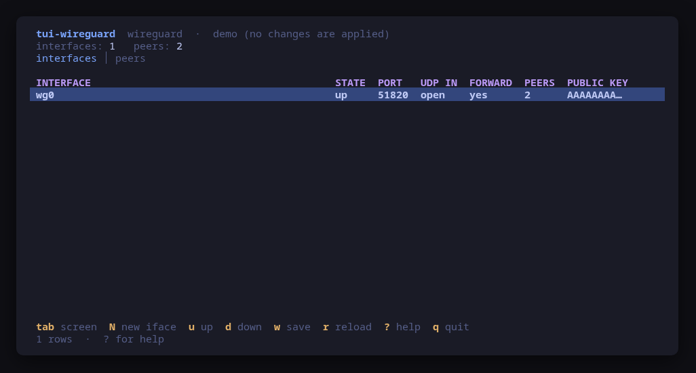
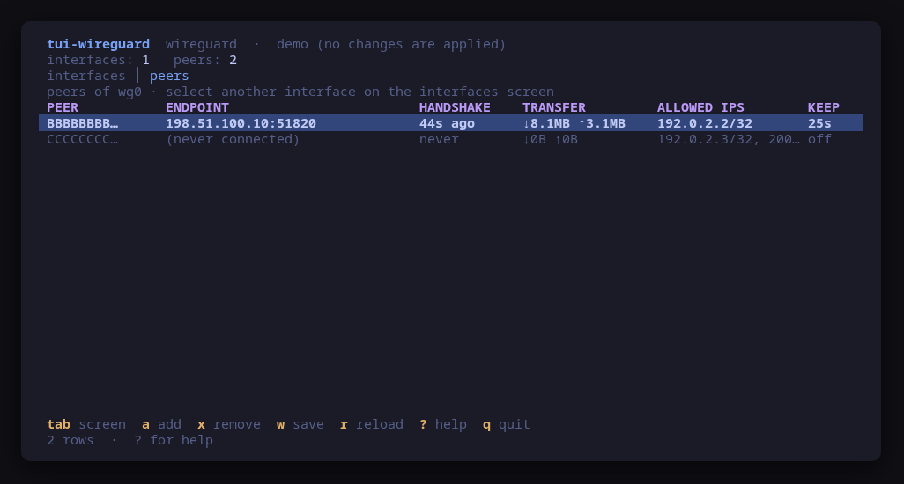
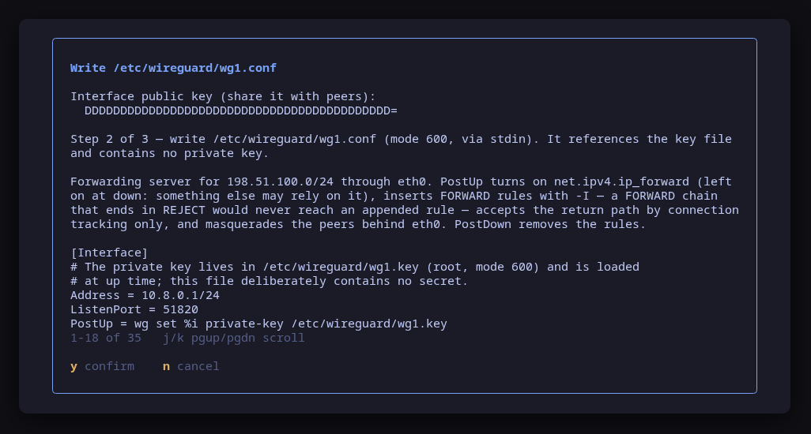
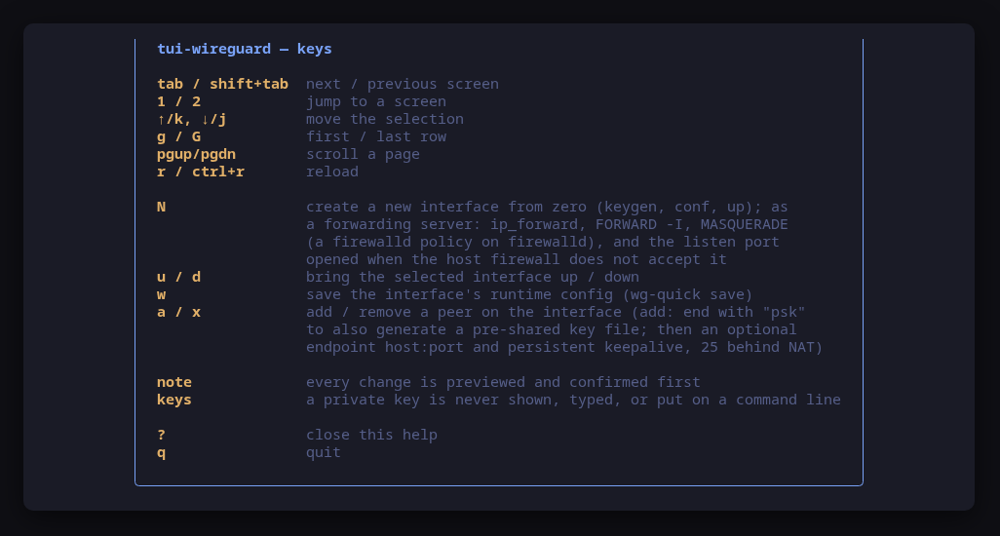

[](https://scorecard.dev/viewer/?uri=github.com/tui-tools/tui-wireguard)

> **Beta.** Flags and keys may still move between 0.x releases.

# tui-wireguard

WireGuard interfaces and peers, from the terminal.

tui-wireguard reads the WireGuard interfaces on a host straight from `wg show all dump` (peers, endpoints, the latest handshake, transfer counters, allowed IPs and keepalive) together with the host around them: whether the firewall lets a handshake reach the listen port, and whether the host forwards for an interface.

It manages as well as reads. Creating an interface from zero (an endpoint, or a forwarding server with its NAT rules and listen port), bringing one up or down, adding or removing a peer, saving the runtime config: every change is shown as the exact command line first and applied only after you confirm it. There is one place a process is ever started, `internal/wireguard`, so the command the dialog showed is provably the command that runs.

A private key is never shown, typed, or put on a command line. Adding a peer needs only its public key; a pre-shared key is passed to `wg` as a file it opens itself, never as an argument (a command line is visible in `ps` to every user on the machine).

## Formerly tui-vpn

This tool was called tui-vpn up to 0.4.x. Two things changed with the name:

- **Headscale moved to tui-tailscale.** The users, nodes, pre-auth keys, routes, transport and OIDC screens (`S`, `O`, `F`, `r`) are now part of [tui-tailscale](https://tui.tools/tools/tui-tailscale/), which manages both sides of a self-hosted tailnet: the Headscale control plane and the Tailscale node. tui-wireguard is plain WireGuard.
- **The package takes over from tui-vpn.** `tui-wireguard` provides, conflicts with and replaces `tui-vpn`, so installing it removes tui-vpn, `dnf upgrade` obsoletes it and `pacman -Syu` offers the replacement. Your configuration is still read from the old place: `/etc/tui-vpn/config.toml`, `~/.config/tui-vpn/config.toml` and `TUI_VPN_*` apply below their `tui-wireguard` counterparts, and the status line (and `--report`) says when an old file was used, so you can move it.

## Try it with nothing installed

```sh
tui-wireguard --demo
```

`--demo` runs every screen against a fake WireGuard host: one forwarding interface with two peers, one mid-handshake and one that has never connected, on a host whose firewall ends INPUT and FORWARD in REJECT with the interface's port opened above it. Nothing on the host is read and nothing is changed.

## Screens

`tab` (or `1` / `2`) switches between them:



- **interfaces**: the WireGuard interfaces on this host, with peer counts and state, whether the host firewall lets a handshake reach the listen port, and whether the host forwards for the interface. `N` creates one from zero (an endpoint, or a forwarding server with its rules), `u` / `d` bring one up or down, `w` saves its runtime config. An interface that is down has no link and no line in `wg show`, so it is listed from its file in `/etc/wireguard` instead, and `u` brings it back.
- **peers**: the peers of the interface selected on the first screen: endpoint, handshake age, transfer, allowed IPs, keepalive. `a` / `x` add or remove a peer (end the add line with `psk` to also generate a pre-shared key file; an optional endpoint and persistent keepalive are asked next); `w` saves.



Every mutation opens a confirm dialog with the exact command before it runs.





## Manage, not view

Beyond up/down and peer add/remove, tui-wireguard can bootstrap and maintain a WireGuard host, always through the same rule: preview the exact command, confirm, run.

### Create an interface from zero (`N`)

On an empty host, `N` on the interfaces screen walks a short wizard (name, address in CIDR form, listen port, role) and then previews each command in turn.

1. **Keygen.** One root shell: `sh -c 'umask 077 && wg genkey | tee /etc/wireguard/<if>.key | wg pubkey'`. The private key is written straight into a root-only file inside that shell and never leaves it; only the public key comes back, shown so you can hand it to peers.
2. **Write the conf.** The file is fed to `install -m 600 /dev/stdin /etc/wireguard/<if>.conf` on stdin, so its content never rides an argv. The conf deliberately contains no private key: it carries `PostUp = wg set %i private-key /etc/wireguard/<if>.key`, so wg-quick loads the key from its file at up time. That is why the confirm dialog can show you the whole file.
3. **Open the listen port**, only when the host firewall does not already accept it (see below).
4. **Bring it up**, the usual `wg-quick up`, optional; esc leaves the interface created but down.

### A forwarding server (`N`, role step)

After the port, `N` asks for the interface's role. An *endpoint* is reached by its peers and nothing else. A *forwarding server* is how peers reach the networks behind this host (a cloud VPC, an office LAN), and it needs three things a bare interface does not have, all found missing on a real Ubuntu 24.04 cloud VM after `N` had created its interface:

- **Which networks it forwards for**, proposed from `ip -j route`: every network this host reaches directly, without the default route, host routes, link-local, links that are down and the WireGuard interfaces themselves. IPv4, in CIDR form; empty means any destination (a full tunnel).
- **Which NIC the traffic leaves by**, proposed as the default route's device.
- **The rules**, written into the interface's own conf as `PostUp`/`PostDown`, so they come and go with the interface, and shown whole in the confirm dialog before the file is written:

```ini
PostUp = sysctl -w net.ipv4.ip_forward=1
PostUp = iptables -I FORWARD -i %i -o eth0 -d 10.0.0.0/16 -j ACCEPT
PostUp = iptables -I FORWARD -i eth0 -o %i -m conntrack --ctstate RELATED,ESTABLISHED -j ACCEPT
PostUp = iptables -t nat -I POSTROUTING -s 10.8.0.0/24 -o eth0 -d 10.0.0.0/16 -j MASQUERADE
PostDown = iptables -D FORWARD -i %i -o eth0 -d 10.0.0.0/16 -j ACCEPT
PostDown = iptables -D FORWARD -i eth0 -o %i -m conntrack --ctstate RELATED,ESTABLISHED -j ACCEPT
PostDown = iptables -t nat -D POSTROUTING -s 10.8.0.0/24 -o eth0 -d 10.0.0.0/16 -j MASQUERADE
```

The FORWARD rules are inserted (`-I`): the provider's Ubuntu image ends its FORWARD chain in `-j REJECT`, and a rule appended after it would never match. The return path is accepted by connection tracking only, so nothing behind the host can open a connection towards the peers. `ip_forward` is left on at down, because something else on the host may rely on it.

**On a firewalld host** (firewalld running when the interface is created) the same intent is written as a firewalld policy instead. firewalld filters forwarded traffic in its own nftables table, and a packet has to be accepted by every table on the forward hook, so an iptables FORWARD accept there forwards nothing. The conf gets one policy owned by the interface, `<interface>-fwd`:

```ini
PostUp = sysctl -w net.ipv4.ip_forward=1
PostUp = firewall-cmd --permanent --delete-policy=wg0-fwd -q 2>/dev/null || true
PostUp = firewall-cmd --permanent --zone=public --add-interface=wg0
PostUp = firewall-cmd --permanent --new-policy=wg0-fwd
PostUp = firewall-cmd --permanent --policy=wg0-fwd --add-ingress-zone=ANY
PostUp = firewall-cmd --permanent --policy=wg0-fwd --add-egress-zone=public
PostUp = firewall-cmd --permanent --policy=wg0-fwd --add-rich-rule='rule family="ipv4" source address="10.8.0.0/24" destination address="10.0.0.0/16" accept'
PostUp = firewall-cmd --permanent --policy=wg0-fwd --add-rich-rule='rule family="ipv4" source address="10.8.0.0/24" destination address="10.0.0.0/16" masquerade'
PostUp = firewall-cmd --reload
PostDown = firewall-cmd --permanent --delete-policy=wg0-fwd
PostDown = firewall-cmd --permanent --zone=public --remove-interface=wg0
PostDown = firewall-cmd --reload
```

- The egress zone is the zone firewalld puts the egress NIC in (its bound zone, else the default zone), read when the wizard runs. Ingress is `ANY` and the rules match the peers' network as the source, so the WireGuard interface stays in whatever zone it falls into and the peers' access to the host itself does not change.
- When neither the WireGuard interface nor the egress NIC is bound to a zone, PostUp binds the WireGuard interface to the zone it falls into anyway (the default zone) and PostDown unbinds it; the example above is that case (a veth or a second NIC that NetworkManager does not manage). It changes nothing for the interface's traffic, but firewalld dispatches no policy between two interfaces that are both only in the default zone's catch-all, so without it the policy exists and forwards nothing. When the egress NIC is bound (NetworkManager binds the NICs it manages), the policy is dispatched on it and the two binding lines are not written.
- Accept and masquerade are rich rules scoped to the peers' network and each destination network, so nothing else that crosses into that zone is accepted or rewritten, and no shared zone setting (such as the zone's own masquerade) is touched. The return path is firewalld's own established/related accept.
- Policies exist only in firewalld's permanent configuration, so the lines are `--permanent` and end in `firewall-cmd --reload`. A reload drops runtime-only firewalld changes made without `--permanent`; the dialog says so. The first line removes a policy left behind by a crash while the interface was up, so `up` never fails on it. `PostDown` deletes the policy, which takes its rules with it, and reloads: after `down` firewalld's running and permanent configuration is back to what it was (firewalld itself keeps a `.xml.old` backup of each file it rewrote under `/etc/firewalld`).
- For the same reason the listen-port step on such a host is `firewall-cmd --permanent --add-port=<port>/udp`: a runtime-only port would be dropped by the reload at `up`. It takes effect at that reload and stays after `down`.

ufw hosts and hosts with a plain nftables or iptables ruleset keep the iptables rules above.

**Known limitation on Ubuntu 26.04.** Its AppArmor profile for `wg-quick` (shipped by the `apparmor` package) lets the hooks' `sysctl` write only `src_valid_mark`, so `PostUp = sysctl -w net.ipv4.ip_forward=1` is denied (an `apparmor="DENIED"` line in the journal) and the interface comes up forwarding nothing while the FORWARD rules are in place. Until the tool turns forwarding on outside `wg-quick`, enable it on such a host with `sysctl -w net.ipv4.ip_forward=1` (and a file in `/etc/sysctl.d/` to keep it).

**The listen port.** The same image ends its INPUT chain in `-j REJECT`, so the WireGuard port was closed even with the cloud's own security list open. When the host firewall does not already accept the port (or cannot be read), the wizard offers one more previewed step, `iptables -I INPUT -p udp --dport <port> -j ACCEPT`, and says plainly that it is not persisted: it is gone at the next reboot or firewall reload. On a firewalld host the step is `firewall-cmd --add-port=<port>/udp` instead: firewalld rejects whatever its zones do not allow in its own nftables table, where an iptables rule is never consulted. When [tui-firewall](https://tui.tools/tools/tui-firewall/) is installed, the dialog says to open the port there to keep it; tui-firewall has no non-interactive mode, so tui-wireguard does not drive it. Otherwise it points at the way to keep it for the firewall in charge (`ufw allow`, `firewall-cmd --permanent`, `netfilter-persistent save`).

The interfaces screen shows both answers for every interface, read from the live firewall (as root):

- **UDP IN** is `open`, `closed` or `?` for the listen port. It is read from [tui-firewall](https://tui.tools/tools/tui-firewall/)'s `--check` when tui-firewall is installed (it knows ufw, firewalld, nftables and iptables), else from `nft -j list ruleset`, else from `iptables -S`. Jumps and gotos are followed into user chains (ufw's, docker's, firewalld's zones), rules that only some senders match are ignored, and a firewalld zone counts when it is the default zone or an interface is bound to it. Where the answer cannot be told (a jump into a chain that was not read, a firewalld service whose ports are not known), it is `?`, never `closed`.
- **FORWARD** is whether the host forwards traffic in on the interface. When firewalld is running it is read from firewalld itself (`firewall-cmd --list-all-policies` and `--list-all-zones`, the running configuration): `yes` when an active policy whose ingress is `ANY` or the interface's zone, and whose egress is not only the host, accepts by its target or by a rich rule (a rich rule scoped to a source address counts only in the interface's own `<interface>-fwd` policy, since the source is what ties it to one interface's peers). Disabled policies (Fedora ships five `gateway-*` policies disabled) do not count. An iptables FORWARD accept on such a host does not count, since firewalld overrules it. Everywhere else it is whether the iptables FORWARD chain accepts traffic in on the interface: where a forwarding server's PostUp puts its rules.

### Persist peer changes (`w`)

`wg set` mutations are runtime-only. After a successful peer add or remove, tui-wireguard offers `wg-quick save <if>`; `w` on the interfaces or peers screen offers it on demand. The dialog warns before you confirm: the save rewrites the conf from runtime state (hand-written comments are lost, and wg-quick inlines the private key into the root-only, mode 600 file, which is standard wg-quick behaviour).

### Endpoint and keepalive on add-peer

After the key line, `a` asks two optional questions. **Endpoint** is where to reach the peer, `host:port` or `[v6]:port` (a DNS name, an IPv4 address, or an IPv6 address in brackets); leave it empty on the side that is dialled, which learns the peer's address from its first handshake. **Persistent keepalive** is a number of seconds, 0-65535, empty or 0 for off; it is prefilled with 25 once an endpoint is given, the usual value for a host behind NAT that dials out. Both land on the one previewed command:

```sh
wg set wg0 peer <public-key> allowed-ips 10.66.0.1/32 endpoint vpn.example.com:51820 persistent-keepalive 25
```

`wg-quick save` persists them with the rest (`Endpoint =` and `PersistentKeepalive =` in the conf), and the peers screen shows them in its ENDPOINT and KEEP columns. A malformed endpoint or an out-of-range keepalive reopens its step with the value as typed and the reason.

### Optional pre-shared key on add-peer

End the add-peer line with `psk` and tui-wireguard first previews a root shell that generates `wg genpsk` into a root-only file, then previews the add-peer command passing `wg` that file's path. The key value never appears on a command line or on screen.

## `--report`, for bug reports

```sh
tui-wireguard --report
```

Prints the versions and machine facts a bug report needs and exits: no UI, no privileges, and nothing about you (no private key, no public key of this host, no endpoint address). It names the wireguard-tools version and how many WireGuard interfaces this host runs, and says when a configuration file of the old tui-vpn name was read. It runs even on a machine with nothing installed, so "there is nothing here to drive" is itself a report worth filing.

## `--check`, one read as JSON

```sh
tui-wireguard --check
```

Reads the interfaces and the host firewall once and prints a summary as JSON: interface and peer counts, per-peer handshake ages, per-interface `listenPortInput` (what the host firewall does with a handshake: `accept`, `reject`, `drop`, or `unknown` when it could not be read or judged; `firewallChecked` says whether it was read, `firewallSource` what answered, `tui-firewall`, `nftables` or `iptables`, and `firewallManager` whether that is `firewalld` or `ufw`) and `forwarding` (`forwardingChecked` says whether the forwarding side was read, `forwardingSource` what answered, `firewalld` or `iptables`, and `forwardingManager` whether that is `firewalld` or `ufw`), and a `compat` block naming the wireguard-tools version.

Like `--report`, it carries no key, no endpoint, no URL and no address of the host: it is meant to be pasted into scripts and issues. `test/smoke.sh` asserts that no `://` survives anywhere in the output, and that the interfaces, ports and peer counts agree with `wg show`.

<!-- install:start -->
<!-- Generated by tui-kit/tools/render-install.py from tool.json. -->
<!-- Edit the manifest, then run `make readme`. -->

### From source

```sh
git clone https://github.com/tui-tools/tui-wireguard
cd tui-wireguard && make demo
```

Not packaged for these yet; the static binary works everywhere in the meantime.

### Arch Linux — coming soon

Needs the tui-tools repository, which is a [one-time
setup](https://tui.tools/install/).

The one-liner detects the distribution and adds the repository and its signing
key:

```sh
curl -fsSL https://pkgs.tui.tools/install.sh | sh
```

Piping a script into a shell is not this family's style, so here is the same
setup by hand — read it, or read the script first with `curl -fsSL
https://pkgs.tui.tools/install.sh -o install.sh`:

```sh
curl -fsSL -o /tmp/tui-tools.asc https://pkgs.tui.tools/pubkey.asc
sudo pacman-key --add /tmp/tui-tools.asc
sudo pacman-key --lsign-key \
  "$(gpg --show-keys --with-colons /tmp/tui-tools.asc | awk -F: '/^fpr:/{print $10; exit}')"
printf '[tui-tools]\nServer = https://pkgs.tui.tools/arch/$arch\n' \
  | sudo tee -a /etc/pacman.conf
sudo pacman -Sy
```

Then, and for every other tool in the family:

```sh
sudo pacman -S tui-wireguard
```

Available once the first release lands in pkgs.tui.tools.

### Debian and Ubuntu — coming soon

Needs the tui-tools repository, which is a [one-time
setup](https://tui.tools/install/).

The one-liner detects the distribution and adds the repository and its signing
key:

```sh
curl -fsSL https://pkgs.tui.tools/install.sh | sh
```

Piping a script into a shell is not this family's style, so here is the same
setup by hand — read it, or read the script first with `curl -fsSL
https://pkgs.tui.tools/install.sh -o install.sh`:

```sh
sudo install -d -m 0755 /etc/apt/keyrings
curl -fsSL https://pkgs.tui.tools/pubkey.asc \
  | sudo gpg --dearmor -o /etc/apt/keyrings/tui-tools.gpg
echo "deb [signed-by=/etc/apt/keyrings/tui-tools.gpg] https://pkgs.tui.tools/deb stable main" \
  | sudo tee /etc/apt/sources.list.d/tui-tools.list
sudo apt update
```

Then, and for every other tool in the family:

```sh
sudo apt install tui-wireguard
```

Available once the first release lands in pkgs.tui.tools.

### Fedora and RHEL — coming soon

Needs the tui-tools repository, which is a [one-time
setup](https://tui.tools/install/).

The one-liner detects the distribution and adds the repository and its signing
key:

```sh
curl -fsSL https://pkgs.tui.tools/install.sh | sh
```

Piping a script into a shell is not this family's style, so here is the same
setup by hand — read it, or read the script first with `curl -fsSL
https://pkgs.tui.tools/install.sh -o install.sh`:

```sh
sudo rpm --import https://pkgs.tui.tools/pubkey.asc
sudo curl -fsSL -o /etc/yum.repos.d/tui-tools.repo https://pkgs.tui.tools/rpm/tui-tools.repo
sudo dnf makecache
```

Then, and for every other tool in the family:

```sh
sudo dnf install tui-wireguard
```

Available once the first release lands in pkgs.tui.tools.

### Any distribution, static binary — coming soon

```sh
curl -fsSL https://github.com/tui-tools/tui-wireguard/releases/download/v0.5.2/tui-wireguard_0.5.2_linux_amd64.tar.gz | tar -xz tui-wireguard
sudo install -m0755 tui-wireguard /usr/local/bin/tui-wireguard
```

Available once the first release is tagged.

### Verify a download

Every release of `tui-wireguard` ships a `checksums.txt`. Check an archive
against it before installing:

```sh
sha256sum -c checksums.txt --ignore-missing
```

Website: https://tui.tools/tools/tui-wireguard/
<!-- install:end -->

<!-- compat:start -->
<!-- Generated by tui-kit/tools/render-compat.py from tool.json. -->
<!-- Edit the manifest, then run `make readme`. -->

`tui-wireguard` probes its backend once at startup and shows the version in the
header. A version nobody has tested is marked `(untested)` there rather than
hidden; one below the minimum is marked as such and the tool still runs.

### wireguard-tools

| | |
| --- | --- |
| Binary | `wg` |
| Version read with | `wg --version` |
| Minimum | 1.0.20200513 |
| Tested | `1.0.20210914`, `1.0.20250521`, `1.0.20260223` |

The tested versions are generated from `compat/results.jsonl`, which the tool's
own smoke test appends to when it runs against a real machine in
[tui-lab](https://github.com/tui-tools/tui-lab).
<!-- compat:end -->

## License

MIT. See [LICENSE](LICENSE).
