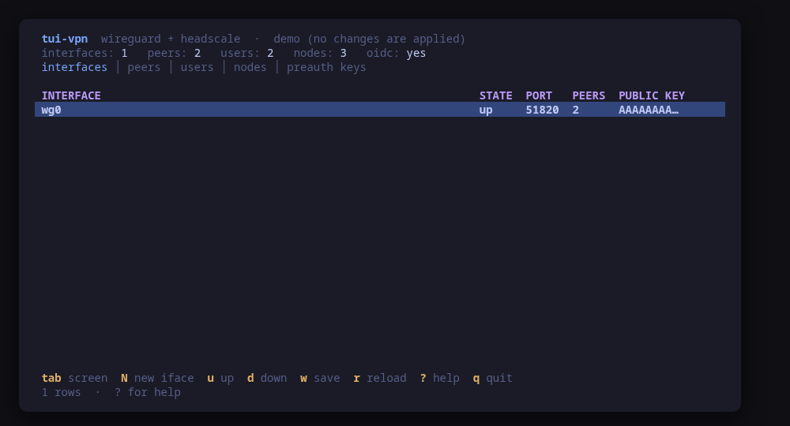
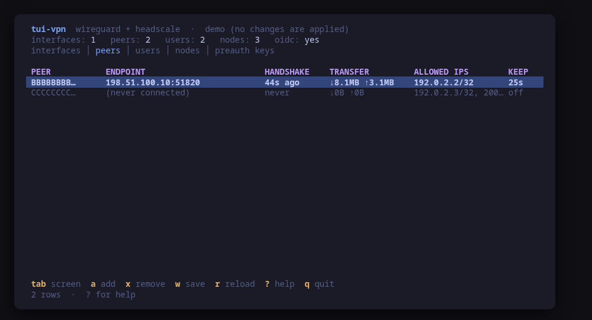
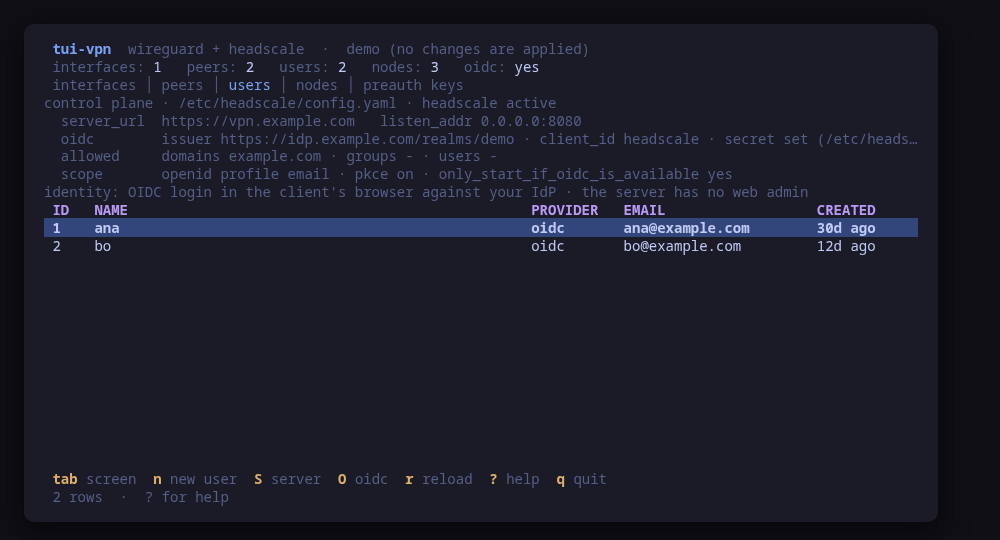
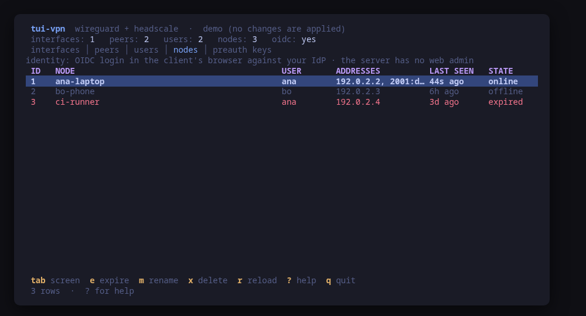
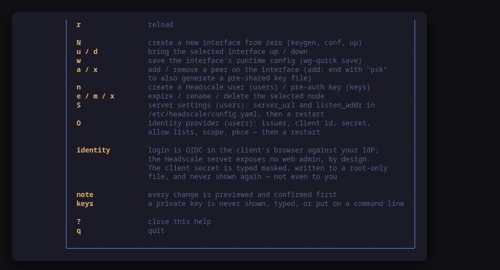

[](https://scorecard.dev/viewer/?uri=github.com/tui-tools/tui-vpn)

> **Beta, and unreleased.** This tool is private while its control-plane path is validated against a real Headscale and an IdP in the lab. Flags and keys may move without notice.

# tui-vpn

WireGuard and its control plane, from the terminal.

tui-vpn reads the WireGuard interfaces on a host straight from `wg show all dump` — peers, endpoints, the latest handshake, transfer counters, allowed IPs and keepalive — and, when a self-hosted [Headscale](https://headscale.net) control plane is present, the users, nodes and pre-authentication keys that decide who is allowed onto the network.

It manages as well as reads. Creating an interface from zero, bringing one up or down, adding or removing a peer, saving the runtime config, expiring, renaming or deleting a node, creating a user or a pre-auth key — every change is shown as the exact command line first and applied only after you confirm it. There is one place a process is ever started, `internal/wireguard`, so the command the dialog showed is provably the command that runs.

## Identity is OIDC, not a web admin

User login is deliberately not in this tool. Identity is OpenID Connect, done in the client's own browser against your IdP; Headscale mirrors the users and nodes the IdP authorises. The Headscale server exposes no web admin, which is the whole point of the design — there is no console to log into, and tui-vpn does not pretend to be one.

What tui-vpn does own is the *configuration* of that identity. See [Identity provider (OIDC)](#identity-provider-oidc) below: `S` and `O` on the users screen write `/etc/headscale/config.yaml` for you, previewing the exact lines they change.

A private key is never shown, typed, or put on a command line. Adding a peer needs only its public key; a pre-shared key is passed to `wg` as a file it opens itself, never as an argument (a command line is visible in `ps` to every user on the machine).

## Try it with nothing installed

```sh
tui-vpn --demo
```

`--demo` runs every screen against a fake WireGuard and a fake Headscale: one interface with two peers — one mid-handshake, one that has never connected — and a control plane with two users, three nodes and a pre-auth key. Nothing on the host is read and nothing is changed.

## Screens

`tab` (or `1`…`5`) switches between them:



- **interfaces** — the WireGuard interfaces on this host, with peer counts and state. `N` creates one from zero, `u` / `d` bring one up or down, `w` saves its runtime config.
- **peers** — the peers of the selected interface: endpoint, handshake age, transfer, allowed-ips, keepalive. `a` / `x` add or remove a peer (end the add line with `psk` to also generate a pre-shared key file); `w` saves.
- **users** — the Headscale users, and the provider they authenticate against, under a panel showing what `/etc/headscale/config.yaml` says: `server_url`, `listen_addr`, the OIDC issuer and client id, whether a client secret is set, the allow lists, and the state of the `headscale` unit. `n` creates a user; `S` and `O` configure the control plane.
- **nodes** — the machines registered with Headscale, who owns each, and key expiry. `e` expires one, `m` renames one, `x` deletes one.
- **preauth keys** — the keys that let a machine register itself, shown by prefix only. `n` creates one, shown exactly once.





The panel is the answer to what the identity note used to leave hanging: which IdP, reachable at which URL, and whether a secret is set — never what it is.



Every mutation opens a confirm dialog with the exact command before it runs.



## Manage, not view

Beyond up/down and peer add/remove, tui-vpn can bootstrap and maintain a WireGuard host — always through the same rule: preview the exact command, confirm, run.

### Create an interface from zero (`N`)

On an empty host, `N` on the interfaces screen walks a three-step wizard: name, address (CIDR) and listen port, then three previewed commands.

1. **Keygen** — one root shell: `sh -c 'umask 077 && wg genkey | tee /etc/wireguard/<if>.key | wg pubkey'`. The private key is written straight into a root-only file inside that shell and never leaves it; only the public key comes back, shown so you can hand it to peers.
2. **Write the conf** — the file is fed to `install -m 600 /dev/stdin /etc/wireguard/<if>.conf` on stdin, so its content never rides an argv. The conf deliberately contains **no private key**: it carries `PostUp = wg set %i private-key /etc/wireguard/<if>.key`, so wg-quick loads the key from its file at up time. That is why the confirm dialog can show you the whole file.
3. **Bring it up** — the usual `wg-quick up`, optional; esc leaves the interface created but down.

### Persist peer changes (`w`)

`wg set` mutations are runtime-only. After a successful peer add or remove, tui-vpn offers `wg-quick save <if>`; `w` on the interfaces or peers screen offers it on demand. The dialog warns before you confirm: the save **rewrites** the conf from runtime state (hand-written comments are lost, and wg-quick inlines the private key into the root-only, mode 600 file — standard wg-quick behaviour).

### Optional pre-shared key on add-peer

End the add-peer line with `psk` and tui-vpn first previews a root shell that generates `wg genpsk` into a root-only file, then previews the add-peer command passing `wg` that file **path**. The key value never appears on a command line or on screen.

### Pre-auth keys (`n` on the keys screen)

Pick the owning user by id and optionally add the words `reusable`, `ephemeral` and an expiration like `30m`, `24h` or `7d` (default `24h`). The previewed command is `headscale preauthkeys create --user <id> [--reusable] [--ephemeral] --expiration <dur>`. Headscale prints the key once; tui-vpn shows it once in the status line with a "shown once — copy it now" note and never stores it. The list keeps showing prefixes only, like headscale's own CLI.

### Server settings (`S` on the users screen)

`S` asks for two values and writes them into `/etc/headscale/config.yaml`:

- **`server_url`** — the base URL clients reach the control plane on, and the URL your IdP redirects a browser back to. tui-vpn warns when it is plain `http` (most IdPs refuse an http redirect URI) or points at loopback (a client's browser cannot reach it). It has to be reachable from the clients' own networks: [tui-cert](https://github.com/tui-tools/tui-cert) issues the certificate, [tui-firewall](https://github.com/tui-tools/tui-firewall) opens the port.
- **`listen_addr`** — the address headscale binds. Loopback or an internal address when a reverse proxy terminates TLS in front of it, `0.0.0.0` when it does not.

The confirm dialog shows a **diff of the changed lines and nothing else**, then the write, then `systemctl restart headscale` as a separate, optional confirm.

### Identity provider (OIDC)

`O` on the users screen configures the whole `oidc:` section: issuer URL, client id, client secret, allowed domains, allowed groups, allowed users, scope (`openid profile email` by default), `only_start_if_oidc_is_available` and `pkce.enabled`.

**What is written where.** Two files, and only two:

| File | What lands in it | Mode |
| --- | --- | --- |
| `/etc/headscale/config.yaml` | every OIDC setting **except** the secret, plus `client_secret_path` pointing at the file below | unchanged (the write truncates in place and keeps the existing owner and mode; a `.bak` copy is taken first) |
| `/etc/headscale/oidc_client_secret` | the client secret, and nothing else | `600`, root, created atomically by `install -m 600` |

**The secret is never shown.** It is typed with the echo masked, travels to the exec site on the command's **standard input** — never on an argv, which is visible in `ps` to every user on the machine — and is dropped from the tool's memory the moment the write command exists, cancelled flows included. It is not in the confirm dialog, not in the status line, not in the diff, and not in `config.yaml`: headscale reads it from the file through `client_secret_path`. The tool will not read it back either; the most it will ever say is `secret set`. When a secret is already configured, leaving the field empty keeps it, and typing a new one replaces it.

A secret found sitting *inline* in `config.yaml` — someone else's setup, or an older one — is flagged in the panel and emptied by the next `O`, because headscale refuses to start with both a secret and a secret path, and because a credential has no business being in a configuration file. The diff redacts that line rather than printing it.

**The diff is minimal, by construction.** `config.yaml` is not re-serialised: it is parsed only to *locate* each key, then spliced line by line, so comments, blank lines, key order and every section the change does not touch survive byte for byte. The lines the dialog shows are provably the only lines that differ.

**The issuer is checked before saving.** tui-vpn fetches `<issuer>/.well-known/openid-configuration` with `curl` **from the server itself** — the machine that will have to reach the IdP — and reports what it found. A failure is a warning, not a refusal: an IdP that is down this minute is not a reason to be unable to write down its address.

**Then a restart.** A configuration change does nothing until the unit that reads it restarts, so the flow ends with `systemctl restart headscale` as its own confirm. Esc there leaves the file written and the running server on the old settings.

One caveat worth knowing: the secret file is `600 root`. If your headscale runs as a non-root user, `chown` it to that user after the first write.

### Node rename and delete (`m` / `x`)

`m` renames the selected node (DNS-label names) via `headscale nodes rename --identifier <id> <name>`; `x` deletes it via `headscale nodes delete --identifier <id> --force` — `--force` because tui-vpn's own confirm dialog is the prompt, and it is painted as a danger dialog.

All of the above works under `--demo` too, against the fake backend, with nothing installed and nothing changed.

## `--report`, for bug reports

```sh
tui-vpn --report
```

Prints the versions and machine facts a bug report needs and exits — no UI, no privileges, and nothing about you: no private key, no public key of this host, no endpoint address. It names the versions of the two backends it drives (`wg` and `headscale`), whether this host runs a WireGuard interface, and whether a control plane is present. It runs even on a machine with neither installed, so "there is nothing here to drive" is itself a filable report.

## `--check`, one read as JSON

```sh
tui-vpn --check
```

Reads the interfaces and the control plane once and prints a summary as JSON: interface and peer counts, per-peer handshake ages, whether Headscale is present, user and node counts, and a `compat` block naming each backend's version.

It also carries a `controlPlane` block read from `/etc/headscale/config.yaml`: `serverUrl`, `listenAddr`, `serviceState`, `oidcIssuer`, `oidcClientId`, whether a client secret is set, and the scope. `oidcConfigured` now comes from that configuration rather than being guessed; the older guess — inferred from users carrying a provider and nodes registered through OIDC — stays as `oidcInferred`, which is the answer used on a host whose `config.yaml` cannot be read.

Like `--report`, it carries no key, no endpoint and no address of the host. The two URLs in the control-plane block are the deliberate exception: an "OIDC does not work" report is unanswerable without them, and both are URLs the clients' browsers are handed anyway. The allow lists are counted rather than printed, because they name people, and the client secret has no field at all.

<!-- install:start -->
<!-- Generated by tui-kit/tools/render-install.py from tool.json. -->
<!-- Edit the manifest, then run `make readme`. -->

### From source

```sh
git clone https://github.com/tui-tools/tui-vpn
cd tui-vpn && make demo
```

Not packaged for these yet; the static binary works everywhere in the meantime.

### Arch Linux — coming soon

Needs the tui-tools repository, which is a [one-time
setup](https://tui-tools.github.io/install/).

The one-liner detects the distribution and adds the repository and its signing
key:

```sh
curl -fsSL https://pkgs.tui.tools/install.sh | sh
```

Piping a script into a shell is not this family's style, so here is the same
setup by hand — read it, or read the script first with `curl -fsSL
https://pkgs.tui.tools/install.sh -o install.sh`:

```sh
curl -fsSL -o /tmp/tui-tools.asc https://pkgs.tui.tools/pubkey.asc
sudo pacman-key --add /tmp/tui-tools.asc
sudo pacman-key --lsign-key \
  "$(gpg --show-keys --with-colons /tmp/tui-tools.asc | awk -F: '/^fpr:/{print $10; exit}')"
printf '[tui-tools]\nServer = https://pkgs.tui.tools/arch/$arch\n' \
  | sudo tee -a /etc/pacman.conf
sudo pacman -Sy
```

Then, and for every other tool in the family:

```sh
sudo pacman -S tui-vpn
```

Available once the first release lands in pkgs.tui.tools.

### Debian and Ubuntu — coming soon

Needs the tui-tools repository, which is a [one-time
setup](https://tui-tools.github.io/install/).

The one-liner detects the distribution and adds the repository and its signing
key:

```sh
curl -fsSL https://pkgs.tui.tools/install.sh | sh
```

Piping a script into a shell is not this family's style, so here is the same
setup by hand — read it, or read the script first with `curl -fsSL
https://pkgs.tui.tools/install.sh -o install.sh`:

```sh
sudo install -d -m 0755 /etc/apt/keyrings
curl -fsSL https://pkgs.tui.tools/pubkey.asc \
  | sudo gpg --dearmor -o /etc/apt/keyrings/tui-tools.gpg
echo "deb [signed-by=/etc/apt/keyrings/tui-tools.gpg] https://pkgs.tui.tools/deb stable main" \
  | sudo tee /etc/apt/sources.list.d/tui-tools.list
sudo apt update
```

Then, and for every other tool in the family:

```sh
sudo apt install tui-vpn
```

Available once the first release lands in pkgs.tui.tools.

### Fedora and RHEL — coming soon

Needs the tui-tools repository, which is a [one-time
setup](https://tui-tools.github.io/install/).

The one-liner detects the distribution and adds the repository and its signing
key:

```sh
curl -fsSL https://pkgs.tui.tools/install.sh | sh
```

Piping a script into a shell is not this family's style, so here is the same
setup by hand — read it, or read the script first with `curl -fsSL
https://pkgs.tui.tools/install.sh -o install.sh`:

```sh
sudo rpm --import https://pkgs.tui.tools/pubkey.asc
sudo curl -fsSL -o /etc/yum.repos.d/tui-tools.repo https://pkgs.tui.tools/rpm/tui-tools.repo
sudo dnf makecache
```

Then, and for every other tool in the family:

```sh
sudo dnf install tui-vpn
```

Available once the first release lands in pkgs.tui.tools.

### Any distribution, static binary — coming soon

```sh
curl -fsSL https://github.com/tui-tools/tui-vpn/releases/download/v0.2.1/tui-vpn_0.2.1_linux_amd64.tar.gz | tar -xz tui-vpn
sudo install -m0755 tui-vpn /usr/local/bin/tui-vpn
```

Available once the first release is tagged.

### Verify a download

Every release of `tui-vpn` ships a `checksums.txt`. Check an archive against it
before installing:

```sh
sha256sum -c checksums.txt --ignore-missing
```
<!-- install:end -->

<!-- compat:start -->
<!-- Generated by tui-kit/tools/render-compat.py from tool.json. -->
<!-- Edit the manifest, then run `make readme`. -->

`tui-vpn` probes its backend once at startup and shows the version in the
header. A version nobody has tested is marked `(untested)` there rather than
hidden; one below the minimum is marked as such and the tool still runs.

### wireguard-tools

| | |
| --- | --- |
| Binary | `wg` |
| Version read with | `wg --version` |
| Minimum | 1.0.20200513 |
| Tested | none yet |

### headscale

| | |
| --- | --- |
| Binary | `headscale` |
| Version read with | `headscale version` |
| Minimum | 0.22.0 |
| Tested | none yet |

| Versions | What changes |
| --- | --- |
| `<0.23` | `preauthkeys list` requires a `--user`, so the pre-auth keys screen may be empty; users and nodes are unaffected |

The tested versions are generated from `compat/results.jsonl`, which the tool's
own smoke test appends to when it runs against a real machine in
[tui-lab](https://github.com/tui-tools/tui-lab).
<!-- compat:end -->

## Phase 2: OpenVPN

OpenVPN is a planned second backend, with [openvpn-auth-oauth2](https://github.com/jkroepke/openvpn-auth-oauth2) for its OAuth2 story. It is not part of this phase.

## License

MIT. See [LICENSE](LICENSE).
